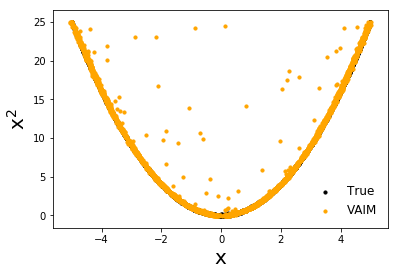
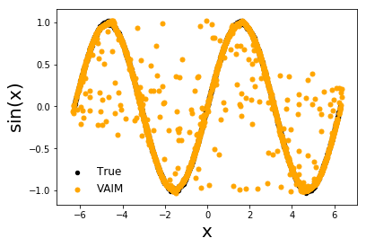

  # VAIM

**This is the implementation of Variational Autoencoder Inverse Mapper: An End-to-End Deep Learning Framework for Inverse Problems (VAIM).**


## Requirements
The code is written in Python3 and requires the following libraries:
* tensorflow==1.11.0
* keras==2.1.2


## Getting started
* Install the python libraries. (See [Requirements](https://github.com/ijcai2021/VAIM#requirements)).
* Download the code from GitHub:
```bash
git clone https://github.com/ijcai2021/VAIM
cd VAIM
```

* Run the python script:
``` bash
python3 train.py
```
* By default the script will run the first toy example which is f</sub>(x) = x<sup>2.
* To run another example, adjust self.example variable in line 12 in VAIM.py.
* To see the jupyter notebbok demo go to VAIM_demo.ipynb.
  
  
 ## Results:
 * The script will create a directory [saved_model/](https://github.com/ijcai2021/VAIM/tree/main/saved_model) and save the the weights with the lowest validation error
 * It will also plot the latent and the results
 
 
| f</sub>(x) = x<sup>2      | f</sub>(x) = sin(x)      |
|------------|-------------|
|  |  |
| f</sub>(x) = x<sup>2      | f</sub>(x) = sin(x)      |
|------------|-------------|
|  |  |


